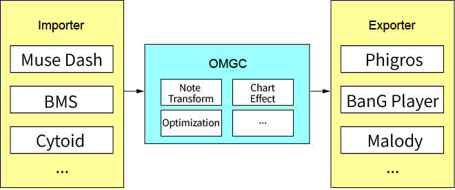

# Open Music Game Chart

Open Music Game Chart，简称OMGC，是一个开放通用的音乐游戏谱面中间格式。OMGC格式能够支持所有广义下落式音游，将谱面的通用内容进行了抽象并统一，在提供通用通用描述的同时，也能完全保留各个原始谱面的自定义特性。OMGC格式的谱面可以从任意符合要求的音游谱面导入，也可以导出为任意支持的其它谱面格式。

## 目录

### 0. [建设背景](#背景)
### 1. [什么是广义下落式音游](fallingrhythmgame.md)
### 2. [OMGC谱面格式](format.md)
### 3. [音符和其它时间线元素](timeline.md)
### 4. [其它资源](#外部资源)
  
## 背景

> 以下内容为个人观点，与实际可能存在差异，仅供参考

纵观国内音游发展史，有这么两个里程碑式的非商业运营游戏，Malody和Phigros。前者带来了多玩法、高度自定义的开放式谱面制作和活跃的玩家社群，后者则把下落式音游的玩法多样性发挥到极致，并且其热度让独立音游制作团队如雨后春笋般涌现。但这井喷式的增长往往带来了诸多问题，经过一段时间的清洗，最后能活下来的新音游寥寥无几。

首先，不少开发者只是单纯有了灵感，便直接按照自己的想法盲目跟风，往往导致了做出来的东西玩法花里胡哨，而完全忽视了音游设计的基础，操作复杂，手感糟糕，完全无视底力，纯粹为了创新而创新。

其次，内容极为空洞，空有玩法而没有与之匹配的谱面。BOF耳熟能详的经典曲目有那么多，随便移植几个谱面就能带来质的飞越；就算考虑版权问题，允许非商业免费使用的曲目也不在少数，完全能够满足曲目要求。

Phigros的成功是短时间难以复刻的，而Malody带来的持续的玩家热度也是需要难以想象的资源投入，如果想要自己的作品带来人气，不能单从炫酷的玩法入手，更需要内容来填充玩家的内心。

首先，音游的灵魂在于谱面，当你听到 **无人区** 这个名字时，无论你是何种音游的玩家，第一印象肯定是魔王曲。也不会有哪一款音游，会不给无人区提供高难度的谱面。当你听到别人讨论 **mopemope** 时，第一个想到的肯定是其猎奇的BGA以及游戏如何还原其名场景。自制谱谱师和高级玩家，往往也会从这些音游名曲中入手进行迁移和重制，自然谱面格式成了传递数据过程中最关键的地方。

然而，各个游戏都会针对自己的游戏特性编制自定义的谱面格式，并针对游戏提供了诸多额外的特性，这就导致了谱面的迁移非常困难。并且往往需要通过拆包和客户端破解的方式对数据进行提取，不仅技术难度大，还存在法律风险。如果能统一谱面格式，方便地进行导入导出，便能够大大降低优质资源的应用和传播难度。但各个游戏间普遍存在玩法差异，这个格式需要具备一定的统一性和扩展性，才能既满足数据迁移的需要，又能保留各自的特性。

此外，针对合法获取歌曲和谱面授权的商业游戏，还得保护其知识产权，不能被用户恶意传播，或者绕过付费渠道进行使用。这就需要规范谱面的数据产权，对谱面采取一定的保护和签名机制，使得合法拥有的玩家和开发团队，可以在许可范围内进行自由使用。

目前，国内外都在积极探索数据资产化，使具有使用价值的数据成为一种资产。通过在市场上对数据资产进行交易，可以给拥有者或使用者带来经济利益。音游谱面作为谱师的劳动成果，具有一定的价值和使用价值，完全可以作为数据资产进行流通。

> 中国信息通信研究院指出，未来数据价值化和市场发展，需要完善数据标准体系，建立多层级的数据管理标准，开展数据标准研制工作，建立包含数据基础术语标准、数据交换共享标准、数据安全隐私标准、数据行业应用标准等在内的标准化体系。加强国际数据治理的沟通与交流，推动建立数据资源国际标准。

## 外部资源

* [PhiFormat](https://phi-x.github.io/PhiFormat/)
* [Cytoid](https://github.com/Cytoid/Cytoid)